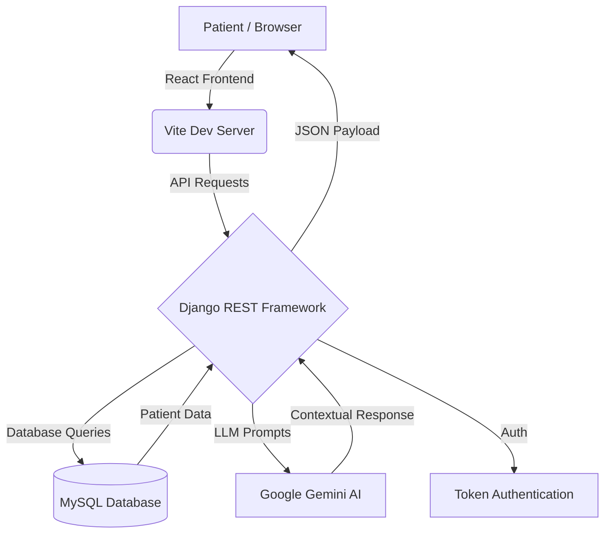

# 🏥 Lucky Clinic Management System (LCMS)


> **"Advanced Care, Intelligent Assistance."**
> A state-of-the-art, full-stack medical clinic management solution featuring a custom-trained AI Assistant, automated patient onboarding, and a high-performance administration dashboard.

---

## 🚀 Overview

The **Lucky Clinic Management System (LCMS)** is designed to modernize clinic operations by bridging the gap between patient accessibility and administrative efficiency. Built with a decoupled architecture (React + Django), it provides a seamless user experience for patients and a robust, data-driven control center for healthcare providers.

---

## 💎 Premium Features

### 🤖 Lucky AI: Advanced Medical Assistant
*   **Engine**: Powered by **Google Gemini 1.5 Flash (v2)** for near-instant response times.
*   **Knowledge Base**: Dynamically analyzes and answers enquiries regarding:
    *   **Specialized Treatments**: Dermatology, Physiotherapy, and Chronic Arthritis care.
    *   **Financials**: OP Consultation fees (₹300) and accepted payment methods (UPI/Cash/Card).
    *   **Logistics**: Live location tracking (Ravipadu Road, Narasaraopet) and operational hours (10 AM - 3 PM).
*   **Smart Features**:
    *   **Voice-to-Text**: Integrated Web Speech API for hands-free enquiry.
    *   **Contextual Memory**: Remembers patient conversation history within the session.
    *   **Safety Guardrails**: Mandatory diagnostic disclaimers ensuring professional medical safety.
    *   **Adaptive UI**: Glassmorphism chat widget with smooth Framer Motion transitions.

### 📅 Intelligent Appointment Ecosystem
*   **Automated Onboarding**: Patients are registered in the clinic database automatically upon their first booking request.
*   **Multi-Channel CTA**: Direct links to **WhatsApp (+91 7207231018)** and an integrated web booking form.
*   **Validation Engine**: Strict input validation to prevent duplicate records and ensure data integrity.

### 📊 Professional Admin Portal
*   **Live Metrics**: Dashboard showing total patient count, daily appointments, and trend analysis.
*   **Security**: Token-based authentication protecting sensitive patient records.
*   **Interface**: Dark-mode optimized, professional medical dashboard layout.

---

## 🛠 Technology Stack & Core Modules

### **Frontend (The Experience Layer)**
*   **Framework**: React 18 with Vite (Ultra-fast build cycles)
*   **Styling**: Vanilla CSS + Tailwind CSS (Custom Design System)
*   **Animation**: Framer Motion (Micro-interactions & Page transitions)
*   **Icons**: Lucide React (Clean, minimalist medical iconography)
*   **Communication**: Axios / Native Fetch for resilient API interactions

### **Backend (The Logic Engine)**
*   **Framework**: Django 5.x (Python)
*   **API Architecture**: Django REST Framework (DRF)
*   **Database**: MySQL 8.0 (Structured relational data)
*   **Environment**: Secure `.env` management for API keys and database credentials.
*   **Dependency Management**: 
    *   `google-genai`: Modern SDK for Gemini integration.
    *   `cryptography`: Secure authentication layer for database handshakes.
    *   `django-cors-headers`: Managed cross-origin resource sharing.

---

## 🗺️ System Architecture



---

## 📦 API Documentation

| Endpoint | Method | Description | Auth Required |
| :--- | :--- | :--- | :--- |
| `/api/chat/` | `POST` | Interacts with the Gemini AI Assistant | No |
| `/api/appointments/` | `POST` | Registers patient & books appointment | No |
| `/api/login/` | `POST` | Admin authentication & Token issuance | No |
| `/api/dashboard/` | `GET` | Retrieves aggregate clinic statistics | Yes (Token) |
| `/api/patients/` | `GET` | Lists all registered patients | Yes (Token) |

---

## 🔑 Admin Setup & Access

### **1. Initial Setup**
To access the administration areas, you must create a superuser in the backend:
```powershell
cd backend
.\venv\Scripts\activate
python manage.py createsuperuser
# Enter username, email, and password
```

### **2. Dashboard Login**
Navigate to `http://localhost:8080/admin-login` and use the following development credentials:

| Field | Development Value |
| :--- | :--- |
| **URL** | `/admin-login` |
| **Username** | `admin` |
| **Password** | `adminpassword` |

---

## 🚀 Installation & Deployment

### **Backend Configuration**
1.  Navigate to `/backend`.
2.  Install dependencies: `pip install -r requirements.txt`.
3.  Configure `.env`:
    ```env
    GEMINI_API_KEY=AIzaSy...
    DB_NAME=lucky_clinic_db
    DB_USER=root
    DB_PASSWORD=your_password
    ```
4.  Apply Migrations: `python manage.py migrate`.
5.  Start Server: `python manage.py runserver`.

### **Frontend Configuration**
1.  Navigate to root directory.
2.  Install dependencies: `npm install`.
3.  Start Dev Server: `npm run dev`.

---

## 📚 Development Topics & Research
This project successfully integrated the following advanced engineering concepts:
- **Provider Migration Strategy**: Architected a seamless transition from OpenAI GPT-3.5 to Google Gemini 1.5, including prompt re-engineering and SDK refactoring.
- **Atomic Registration Pattern**: Implemented a "Register-on-Book" logic where patient profiles are created in the same database transaction as the appointment.
- **Dependency Isolation**: Resolved environment-specific MySQL authentication failures by pinpointing and installing the `cryptography` bridge.
- **Rebranding Deployment**: Orchestrated a site-wide identity swap (Kondapalli → Lucky Hospitals), including deep-link updates and asset replacement.
- **Glassmorphism UI**: Engineered a modern aesthetic using backdrop-filter utilities and Framer Motion's `AnimatePresence`.

---

## 📞 Clinic Contact & Location
- **Clinic**: Lucky Hospital Centre
- **Dermatologist**: Dr. Lucky
- **Phone**: +91 7207231018
- **Address**: Ravipadu Road, Narasaraopet, AP - 522601.
- **Fee**: ₹300 (Standard OP)

---

> Built with ❤️ by the Lucky Clinic Dev Team.
